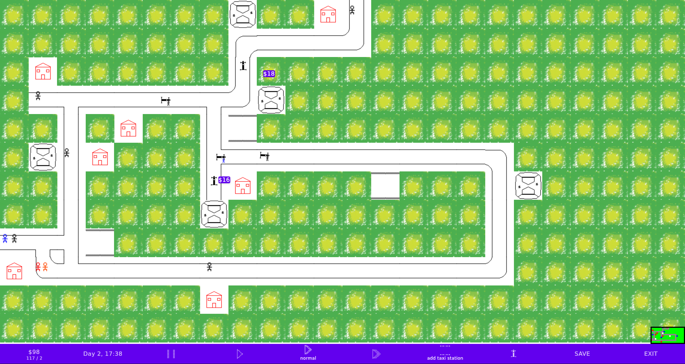

# Super Hacky Compose City Game

A super simple City Builder game inspired by Mini Motorways.

There is no nice code to see here, it is all a hack, but I cannot share it w/o the code so here it is  ¯\_(ツ)_/¯.

# Screenshots
(yea, I know the assets are amazing 😛 )

# Copyright
Copyright 2021 Yigit Boyar

Licensed under the Apache License, Version 2.0 (the "License");
you may not use this file except in compliance with the License.
You may obtain a copy of the License at

    https://www.apache.org/licenses/LICENSE-2.0

Unless required by applicable law or agreed to in writing, software
distributed under the License is distributed on an "AS IS" BASIS,
WITHOUT WARRANTIES OR CONDITIONS OF ANY KIND, either express or implied.
See the License for the specific language governing permissions and
limitations under the License.
